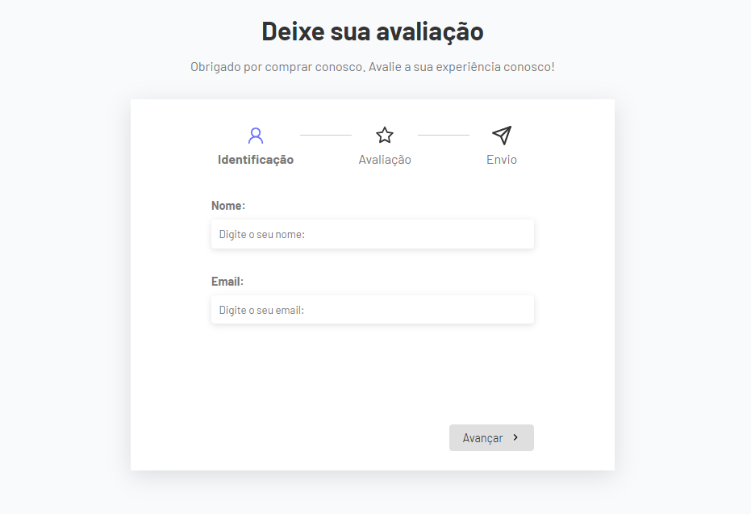
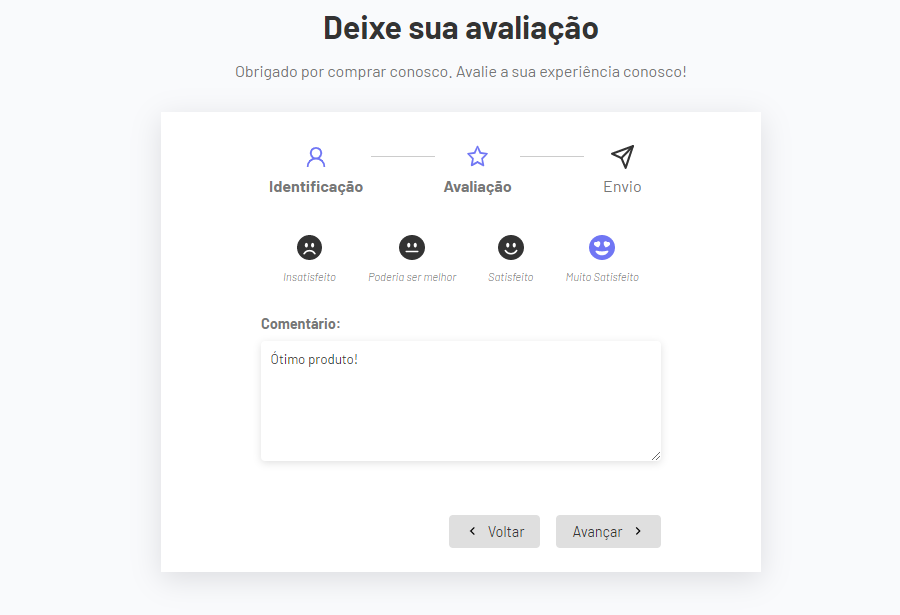
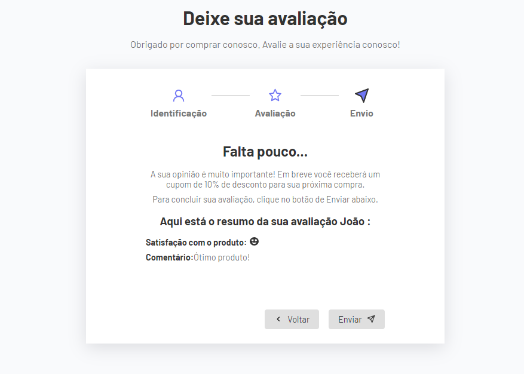

<h1 align="center"> Formulário multietapas </h1>

Formulário de avaliação em multietapas

  <a href="#-tecnologias">Tecnologias</a>&nbsp;&nbsp;&nbsp;|&nbsp;&nbsp;&nbsp;
  <a href="#-projeto">Projeto</a>&nbsp;&nbsp;&nbsp;|&nbsp;&nbsp;&nbsp;
  <a href="#memo-licença">Licença</a>

  

 

 
  
  
  

## 🚀 Tecnologias

Esse projeto foi desenvolvido com as seguintes tecnologias:

- HTML e CSS
- JavaScript
- React Js.
- [Vite](https://vitejs.dev/)

## 💻 Projeto

O formúlario multietapas é uma ótima opção para que o usuário preencha dados sem que todos os campos sejam apresentados de forma imediata.
Você pode visualizar o projeto no ar [AQUI](https://formulario-multietapas.vercel.app/)

## :memo: Licença

Esse projeto está sob a licença MIT.

---
